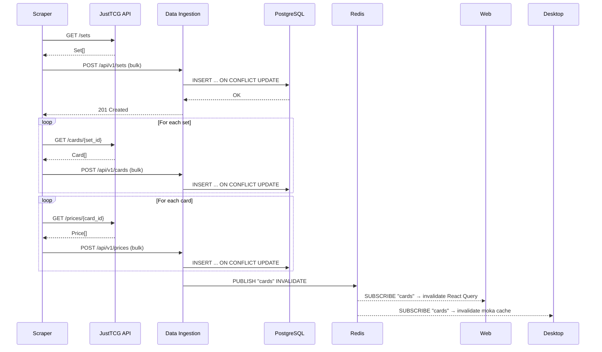
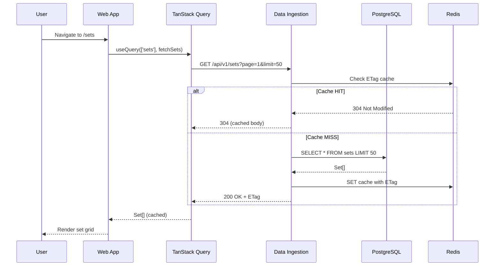
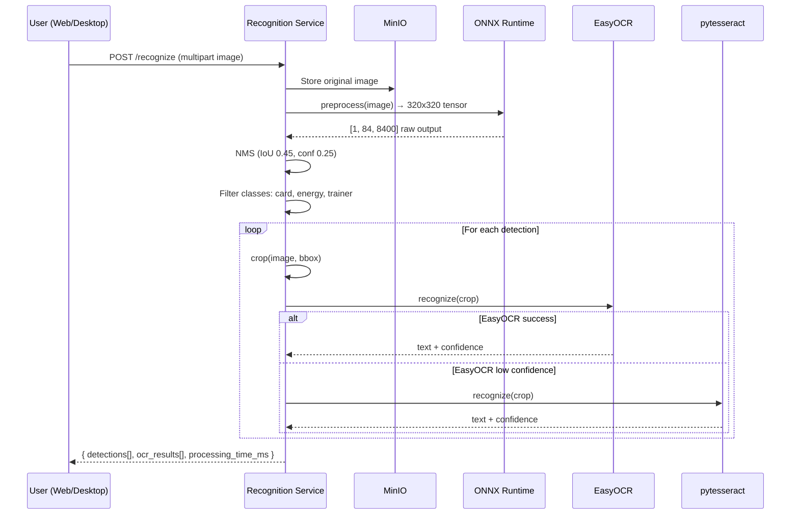
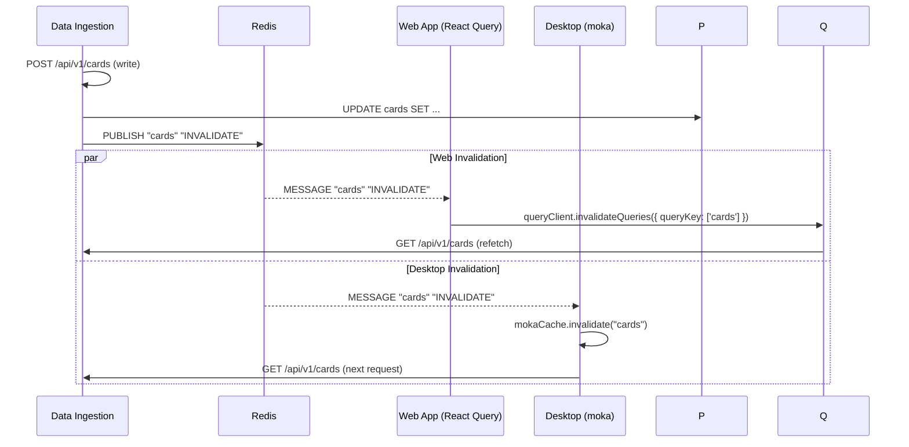
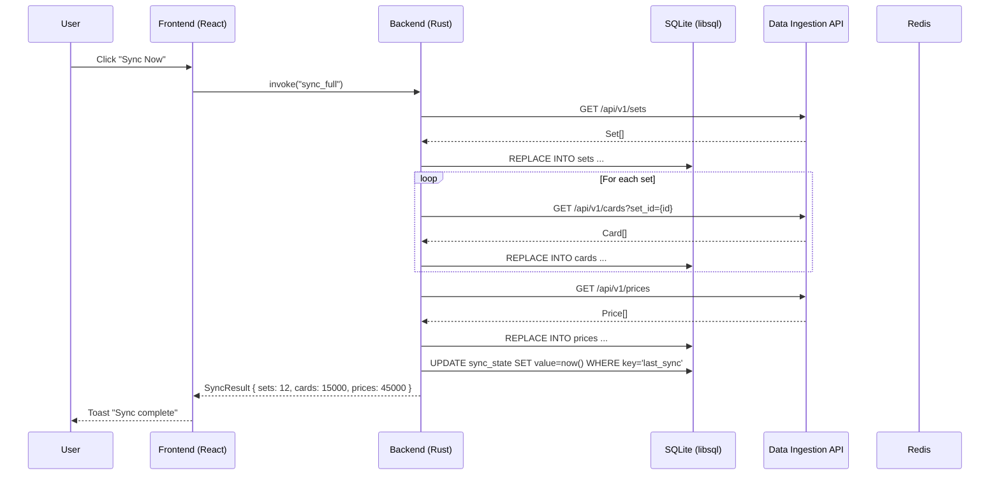
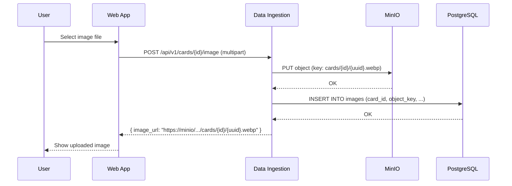

# Data Flow Diagrams

## Full System Flow

```
┌─────────────┐     ┌──────────────┐     ┌─────────────┐
│  JustTCG    │────►│   Scraper    │────►│  PostgreSQL │
│    API      │     │  (Port 8002) │     │  (Port 5432)│
└─────────────┘     └──────────────┘     └──────┬──────┘
                                                 │
                        ┌──────────────┐         │
                        │ Data Ingestion│◄────────┘
                        │  (Port 8000) │
                        └──────┬───────┘
                               │
                 ┌─────────────┼─────────────┐
                 ▼             ▼             ▼
          ┌──────────┐  ┌──────────┐  ┌──────────┐
          │   Web    │  │ Desktop  │  │Recognition│
          │ (Port3000)│  │  (Tauri) │  │(Port 8001)│
          └──────────┘  └──────────┘  └──────────┘
                 ▲             ▲
                 │             │
                 └──────┬──────┘
                        ▼
                 ┌──────────┐
                 │  Redis   │
                 │(Port 6379)│
                 └──────────┘
```

## Scraper → Data Ingestion → PostgreSQL



## Web App: Set Browse Flow



## Recognition Pipeline



## Cache Invalidation Flow



## Desktop Sync Flow



## Image Upload Flow



## Error Handling Flows

### Recognition Failure

```
POST /recognize
    │
    ├─► Image decode error → 400 Bad Request { "error": "Invalid image format" }
    │
    ├─► ONNX inference error → 500 Internal Server Error { "error": "Model inference failed" }
    │
    ├─► OCR timeout (30s) → 504 Gateway Timeout { "error": "OCR processing timeout" }
    │
    └─► Success → 200 OK { detections: [...], ocr_results: [...] }
```

### Scraper Rate Limit

```
GET /cards/{set_id}
    │
    ├─► 429 Too Many Requests → wait Retry-After header → retry (max 3)
    │
    ├─► 5xx Server Error → exponential backoff → retry (max 3)
    │
    └─► Success → process cards
```

### Database Connection Failure

```
Any DB operation
    │
    ├─► Connection pool exhausted → 503 Service Unavailable
    │
    ├─► Query timeout (30s) → 504 Gateway Timeout
    │
    └─► Constraint violation → 409 Conflict { "error": "Duplicate key" }
```